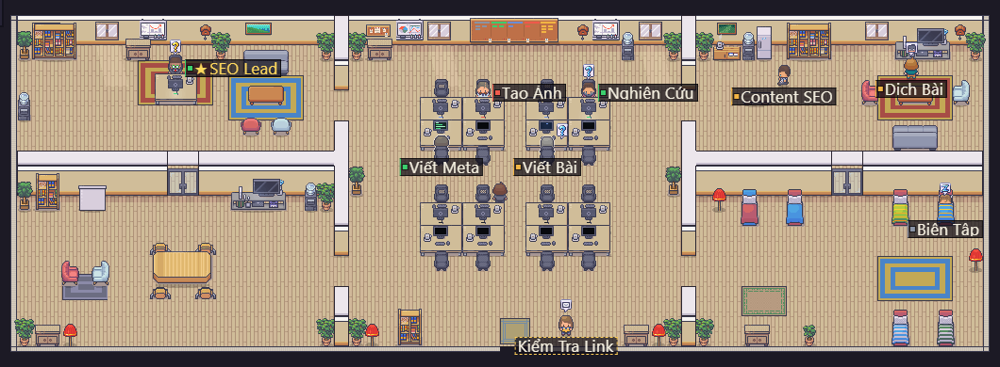
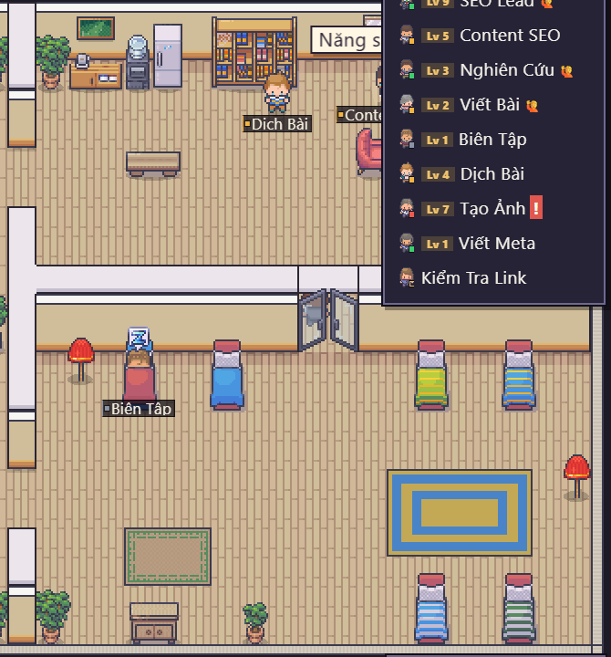
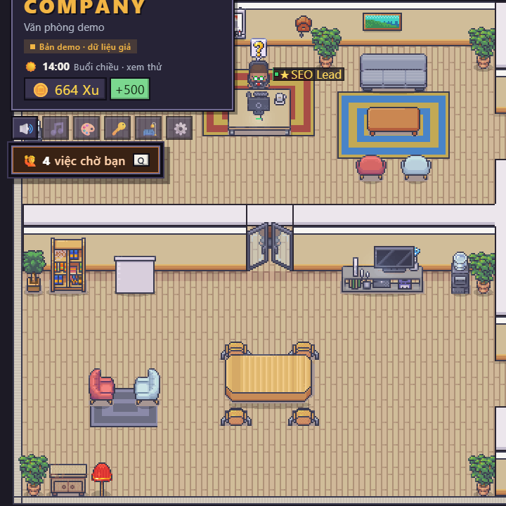
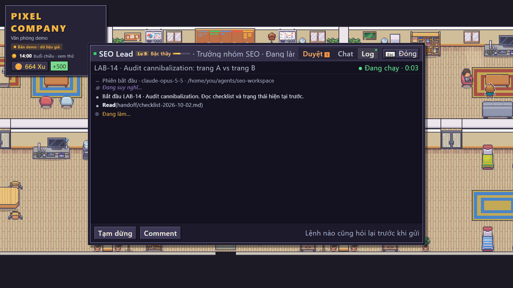
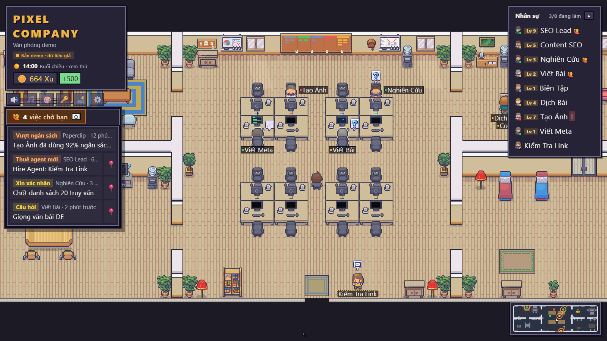
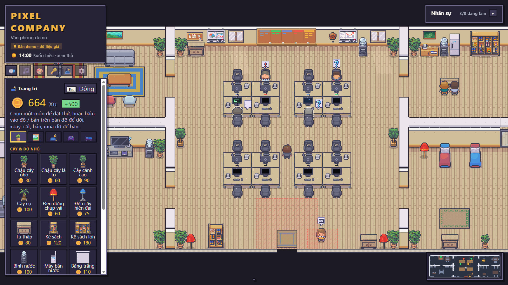
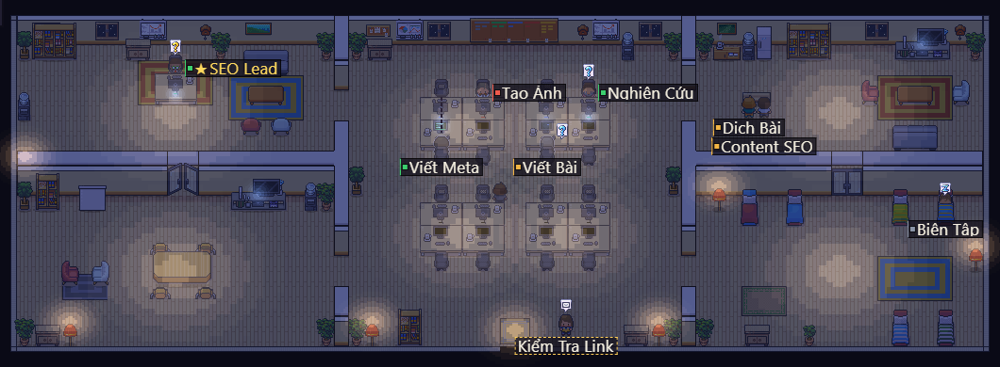

<h1 align="center">Pixel Company</h1>

<p align="center"><b>A cozy pixel-art office for your AI agents.</b></p>

<p align="center">
  <a href="https://github.com/minhle2112/pixel-company/releases">⬇️ Download for Windows</a> •
  <a href="docs/GUIDE.md">📖 Full guide</a> •
  <a href="docs/GUIDE.vi.md">🇻🇳 Hướng dẫn tiếng Việt</a> •
  <a href="https://github.com/paperclipai/paperclip">📎 Paperclip</a>
</p>



Pixel Company turns the AI agents of your [Paperclip](https://github.com/paperclipai/paperclip) company into little pixel-art employees in a Stardew Valley-style office. They sit at their desks while they work, raise a hand when they need your approval, wander off to the lounge for coffee when they are idle, and go to bed when you pause them. You walk around the office, open any agent's live CLI, chat with it, approve requests and hire new staff, all without leaving the game.

Finished tickets earn your company **Xu** (coins), which you spend in the shop to furnish and decorate the office.

> The app interface is in Vietnamese. Screenshots use the built-in demo data.

## Features

- **One agent, one employee.** Every Paperclip agent gets its own character and desk, grouped by team: the Lead has a private office, members sit in desk pods.
- **Live status.** Characters type when the agent runs, raise a hand when it waits for you, doze off when paused and show a red "!" on errors. Everything updates in real time over Paperclip's WebSocket.
- **Agent panel.** Click an agent to see its run log rendered like Claude Code, chat with it (Paperclip Agent Chat), and approve or reject its requests. Every command asks for confirmation first.
- **Office life.** Idle agents only hang out in the lounge and the bedroom: they sit on the sofa, watch TV, make coffee, raid the fridge, read and chat. Paused agents sleep in a free bed.
- **Approvals inbox.** Hire requests, budget alerts, confirmations and questions in one list (**Q**). Hire requests are flagged when they break the team rules.
- **Xu, shop and decorating.** About 50 pieces of furniture in 5 groups. Place, rotate, move, store or sell them. Agents unlock personal desk items as they level up.
- **EXP and levels.** Agents earn EXP for finished work. The fame board ranks them by week or all time.
- **Day and night** on Vietnam time, generative lofi music, and a wardrobe to restyle every character.
- **House designer** (dev tool): draw rooms, doors, partitions, floors, desk pods and preset furniture, then save to regenerate the map.
- **Windows app** with its own window. It finds and starts the Paperclip you already have and never touches Paperclip's data.

| Lounge and bedroom | Lead's office and meeting room |
|---|---|
|  |  |

| Agent CLI | Approvals inbox |
|---|---|
|  |  |

| Shop and decorating | Night |
|---|---|
|  |  |

## Requirements

- **Windows 10/11 x64** for the desktop app. Running from source works anywhere Node.js does.
- **[Paperclip](https://github.com/paperclipai/paperclip)** with at least one company and some agents. The app can install Paperclip for you with npm, which needs [Node.js](https://nodejs.org) 24.11 or newer.
- **Pixel art:** the Windows download already includes the [LimeZu](https://limezu.itch.io) images it uses. To run from source you need to buy two LimeZu packs yourself (see below).

## Getting started

### Windows app

1. Download `PixelCompany-Setup-<version>.exe` from [Releases](https://github.com/minhle2112/pixel-company/releases) and install it. If the installer is blocked (e.g. by Smart App Control), use the `.zip` instead and run `Pixel Company.exe`.
2. The app is not code-signed yet: on "Windows protected your PC", click **More info → Run anyway**.
3. On first launch the app looks for Paperclip and shows a connect screen to confirm the address and data folder.

Want to look around first? Click **Xem bản demo** (demo) on the connect screen.

### From source

```bash
git clone https://github.com/minhle2112/pixel-company.git
cd pixel-company
npm install
```

Buy the 16×16 versions of LimeZu's [Modern Interiors](https://limezu.itch.io/moderninteriors) and [Modern Office](https://limezu.itch.io/modernoffice), and unzip them into `../coopverse-assets/limezu` (next to the project folder), or point `COOPVERSE_ASSETS` in `.env` to them. Then:

```bash
npm run dev
```

Open <http://127.0.0.1:5179>. Pixel Company finds Paperclip at `127.0.0.1:3100`. Without Paperclip, open <http://127.0.0.1:5179/?demo> for fake data.

See the [full guide](docs/GUIDE.md) for Paperclip setup, the Paperclip sidebar button plugin, controls, configuration, troubleshooting and development notes.

## Controls

| Key | Action |
|---|---|
| **W A S D** / arrows | Walk (**Shift** to run) |
| **E** / click | Open an agent's CLI and chat, the ticket board, or use furniture |
| **Q** | Approvals inbox |
| **T** | Shop and decorating |
| **C** | Wardrobe |
| **M** | Music |

## How it works

- The browser never talks to Paperclip directly: every call goes through a small local server with an allow-list of Paperclip endpoints, bound to `127.0.0.1` only.
- Office state (furniture, Xu spent) and the EXP ledger are stored by Pixel Company per company. Nothing is written to Paperclip except the commands you confirm.
- Built with Vite, React 19, PixiJS 8, zustand and TypeScript. The desktop app is Electron.

## License

Code: [MIT](LICENSE).

Pixel art: **LimeZu**, [Modern Interiors](https://limezu.itch.io/moderninteriors) and [Modern Office](https://limezu.itch.io/modernoffice). The art is not in this repository and is not covered by the MIT license. The Windows downloads include the images the app uses, only to run Pixel Company: please do not extract, reuse or share them. Thanks, LimeZu!
