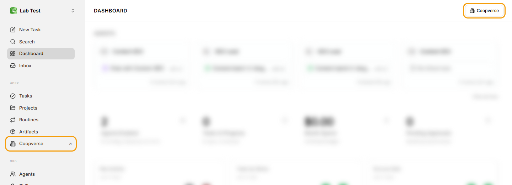
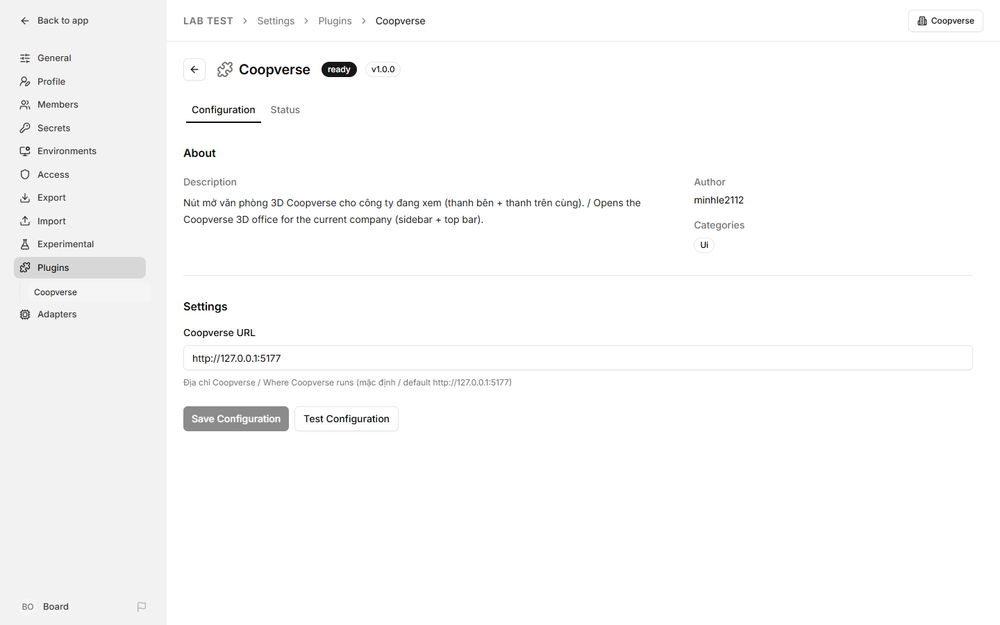

# Pixel Company: hướng dẫn đầy đủ

[← README](../README.md) · [English](GUIDE.md)

## Mục lục

1. [Cần chuẩn bị](#1-cần-chuẩn-bị)
2. [Cài Paperclip](#2-cài-paperclip)
3. [Tạo công ty, agent và bật Agent Chat](#3-tạo-công-ty-agent-và-bật-agent-chat)
4. [Cài Pixel Company](#4-cài-pixel-company)
5. [Cài nút Pixel Company vào Paperclip](#5-cài-nút-pixel-company-vào-paperclip)
6. [Cách dùng](#6-cách-dùng)
7. [Cấu hình](#7-cấu-hình)
8. [Xử lý sự cố](#8-xử-lý-sự-cố)
9. [Bảo mật](#9-bảo-mật)
10. [Dành cho người phát triển](#10-dành-cho-người-phát-triển)

---

## 1. Cần chuẩn bị

| Cần gì | Ghi chú |
|---|---|
| **Node.js 24.11 trở lên** | Paperclip yêu cầu bản này. Pixel Company chạy được với Node 22.12+. Tải ở [nodejs.org](https://nodejs.org). |
| **Git** | Để tải mã nguồn. |
| **Chrome hoặc Edge** | Cần WebGL (PixiJS). |
| **Gói hình LimeZu** | Modern Interiors và Modern Office, mua trên itch.io. Xem [bước 4](#4-cài-pixel-company). |
| **Tài khoản cho agent** | Agent của Paperclip chạy bằng Claude Code, Codex, Gemini… Ví dụ với Claude Code: cài `claude` và đăng nhập trước. |
| **Windows** | Nên chạy Paperclip trong **WSL2** (Ubuntu), còn Pixel Company chạy trên Windows. Đây là cách đã thử kỹ nhất. |

Pixel Company đã thử với Paperclip **2026.916.1**.

## 2. Cài Paperclip

Chạy trong terminal (Windows thì chạy trong WSL):

```bash
npx paperclipai@latest onboard --yes
```

Lệnh này tạo cấu hình, cơ sở dữ liệu (PostgreSQL nhúng, không phải cài gì thêm) và bật Paperclip ở **http://localhost:3100**. Mở địa chỉ đó trong trình duyệt để kiểm tra.

Muốn có lệnh `paperclipai` dùng lâu dài (khuyên dùng):

```bash
npx paperclipai@latest install --yes
```

Từ lần sau, bật Paperclip bằng:

```bash
paperclipai run
```

> Xem thêm hướng dẫn gốc của Paperclip: <https://github.com/paperclipai/paperclip>

## 3. Tạo công ty, agent và bật Agent Chat

1. Mở http://localhost:3100. Lần đầu Paperclip hướng dẫn tạo **công ty** đầu tiên.
2. Vào **Agents** để thêm agent (tên, vai trò, adapter như Claude Code).
   - Pixel Company xếp chỗ ngồi theo sơ đồ tổ chức. Agent không báo cáo cho ai mà có người **báo cáo cho mình** (trường *Reports to*) là **Lead** (★), ngồi bàn riêng nếu trang thiết kế nhà có đặt bàn Lead, không thì ngồi trước ở cụm bàn; các agent còn lại ngồi theo nhóm của Lead. Không có agent con: chỉ Lead đề xuất thuê người, thẻ duyệt báo đỏ nếu một thành viên xin thuê phụ tá hoặc người mới báo cáo cho một thành viên.
   - Văn phòng có 16 bàn (4 cụm × 4 bàn), cộng bàn Lead nếu có. Agent không còn chỗ thì vẫn có trong danh sách Nhân sự (mở CLI được) nhưng không hiện trên bản đồ.
3. **Bật Agent Chat** để chat được trong Pixel Company: **Settings → Experimental → Agent Chat** (bật công tắc). Tính năng này bật cho cả Paperclip, không phải bật riêng từng công ty.


## 4. Cài Pixel Company

### Cách nhanh: app cho Windows

Tải `PixelCompany-Setup-<phiên bản>.exe` ở mục [Releases](https://github.com/minhle2112/pixel-company/releases) rồi cài như phần mềm bình thường. App có cửa sổ riêng, lối tắt trên Desktop và Start menu, gỡ được trong Settings của Windows.

- **Windows báo "Windows protected your PC"**: file cài chưa có chữ ký số. Bấm **More info → Run anyway**.
- **Máy bật Smart App Control** (Windows 11): tính năng này có thể chặn hẳn file cài chưa ký số, và không có nút "Run anyway". Khi đó tải bản **`PixelCompany-<phiên bản>-win-x64.zip`** ở cùng trang:
  1. Chuột phải → **Extract All** (giải nén) vào một thư mục cố định, vd `C:\Pixel Company`.
  2. Mở `Pixel Company.exe` trong đó. Muốn có lối tắt thì chuột phải `Pixel Company.exe` → **Show more options → Send to → Desktop**.
  3. Bản zip không cần cài và không có mục gỡ trong Settings: xoá thư mục là gỡ. Cài đặt của app nằm ở `%APPDATA%\Pixel Company`, dùng chung với bản cài, nên đổi qua lại không mất gì.
- **Lần đầu mở**, app tự tìm Paperclip trên máy (đang chạy, hoặc lệnh `paperclipai`) và hiện màn hình **Kết nối Paperclip** để bạn kiểm tra:
  - **Địa chỉ Paperclip**: điền sẵn nếu tìm thấy.
  - **Khi Paperclip chưa chạy**: tự bật lệnh `paperclipai` (cài bằng npm), tự bật trong một **thư mục cài riêng** (thư mục có `node_modules\paperclipai`), tự bật trong **WSL**, hoặc không tự bật.
  - **Thư mục dữ liệu Paperclip**: thư mục bạn vẫn truyền bằng `-d` (để trống nếu dùng mặc định `~\.paperclip`). Chọn xong, app tự đọc cổng của Paperclip trong đó.
- **Máy chưa có Paperclip**: bấm **Cài Paperclip**, app chạy `npm install -g paperclipai` (cần [Node.js](https://nodejs.org) 24.11 trở lên).
- **Hình pixel**: file tải về đã kèm sẵn những hình LimeZu mà app dùng, chỉ để dùng trong Pixel Company (xem giấy phép bên dưới). Ai có gói LimeZu riêng thì vẫn chọn được thư mục của mình trong **Cài đặt → Ứng dụng → Thư mục gói hình…**.
- **Dữ liệu của bạn an toàn**: app không mang theo Paperclip riêng và không đụng vào dữ liệu Paperclip. Nó chỉ bật đúng bản Paperclip đã cài, với đúng thư mục dữ liệu của bạn, nên không có chuyện hai phiên bản nâng cấp database của nhau.
- **Đóng app**: nếu chính app đã bật Paperclip thì app tắt Paperclip theo. Có agent đang làm việc thì app hỏi trước. App tắt kiểu "tắt gọn", giống nhấn Ctrl+C trong cửa sổ Paperclip: chờ lượt chạy dừng rồi đóng database. Paperclip bạn tự bật từ trước thì app không tắt.
- Đổi kết nối, đổi thư mục hình, nhập điểm EXP từ bản chạy bằng trình duyệt (thư mục `.coopverse`), kiểm tra bản mới: **Cài đặt ⚙️ → Ứng dụng**. Có bản mới thì app báo và mở trang tải về, không tự cài. **F11**: toàn màn hình.

### Cài bằng mã nguồn (chạy trên trình duyệt)

Chạy trên máy bạn dùng trình duyệt (Windows: chạy trong PowerShell hoặc Git Bash, **không** chạy trong WSL):

```bash
git clone https://github.com/minhle2112/pixel-company.git
cd pixel-company
npm install
```

**Đặt gói hình pixel (bắt buộc khi chạy từ mã nguồn).** Bản pixel dùng 2 gói của LimeZu, bản 16×16:

- **Modern Interiors**: <https://limezu.itch.io/moderninteriors>
- **Modern Office**: <https://limezu.itch.io/modernoffice>

Mua và tải về, rồi giải nén như sau (mặc định Pixel Company tìm ở thư mục `coopverse-assets/limezu` nằm **cạnh** thư mục dự án):

```
coopverse-assets/limezu/
  1_Interiors/ 2_Characters/ 4_User_Interface_Elements/ …   ← nội dung gói Modern Interiors
  Modern_Office/
    Modern_Office_16x16.png …                                 ← nội dung gói Modern Office
```

Để chỗ khác thì đặt `COOPVERSE_ASSETS=<đường dẫn tới thư mục limezu>` trong file `.env`. Thiếu gói nào thì văn phòng hiện thông báo "Chưa có gói hình pixel" kèm hướng dẫn.
Hình chỉ được phục vụ cho chính máy bạn (`127.0.0.1`) khi chạy Pixel Company. Đừng commit hay chia sẻ lại các file hình: giấy phép của LimeZu không cho phát tán lại.

Rồi chạy:

```bash
npm run dev
```

Mở **http://127.0.0.1:5179**. Pixel Company tự tìm Paperclip ở `127.0.0.1:3100` và mở công ty đầu tiên.

**Trên Windows** có sẵn `start-pixel-company.cmd`, chỉ cần bấm đúp. Script này:

1. Kiểm tra Paperclip đã chạy chưa.
2. Chưa chạy thì tự bật trong một cửa sổ thu nhỏ tên "Paperclip". Có hai cách:
   - Paperclip trong WSL: thêm `PAPERCLIP_WSL_DISTRO=Ubuntu` (tên bản WSL của bạn, xem bằng `wsl -l`) vào file `.env`.
   - Paperclip cài thẳng trên Windows: script tự dùng lệnh `paperclipai` nếu tìm thấy.
3. Cài thư viện lần đầu, bật Pixel Company và mở trình duyệt.

Muốn xem thử trước khi có Paperclip: mở **http://127.0.0.1:5179/?demo** để dùng dữ liệu giả.

## 5. Cài nút Pixel Company vào Paperclip

Thư mục [`paperclip-plugin/`](../paperclip-plugin) là một plugin Paperclip. Nó thêm mục **Pixel Company ↗** vào thanh bên trái và nút **Pixel Company** ở góc trên phải mọi trang. Bấm vào là mở Pixel Company đúng công ty bạn đang xem, luôn dùng chung một tab.



Plugin đã được build sẵn trong `paperclip-plugin/dist`, không cần build lại. Chạy lệnh cài **trên máy đang chạy Paperclip**:

```bash
paperclipai plugin install --local /đường/dẫn/tới/pixel-company/paperclip-plugin
```

(Chưa có lệnh `paperclipai` thì thay bằng `npx paperclipai@latest plugin install --local …`.)

Đường dẫn phải là đường dẫn mà Paperclip thấy được:

- **Linux / macOS**: ví dụ `~/pixel-company/paperclip-plugin`.
- **Windows + WSL**: ổ C nằm ở `/mnt/c/`, ví dụ `/mnt/c/Users/ban/pixel-company/paperclip-plugin`. Nếu WSL đã tắt truy cập ổ Windows, chép thư mục vào trong WSL trước rồi cài từ đó:

  ```bash
  mkdir -p ~/paperclip-plugins
  cp -r /mnt/c/Users/ban/pixel-company/paperclip-plugin ~/paperclip-plugins/pixel-company
  paperclipai plugin install --local ~/paperclip-plugins/pixel-company
  ```

Cài xong, tải lại trang Paperclip là thấy nút. Kiểm tra trong **Settings → Plugins**: dòng Pixel Company phải có chữ `ready`.


Nút mặc định mở `http://127.0.0.1:5179` (bản chạy từ mã nguồn). Pixel Company chạy ở địa chỉ khác thì vào **Settings → Plugins → Pixel Company → Configure**, sửa **Pixel Company URL** rồi bấm **Save Configuration**.



Các lệnh khác:

```bash
paperclipai plugin list                          # xem plugin đã cài
paperclipai plugin disable coopverse.launcher    # tạm ẩn nút
paperclipai plugin enable coopverse.launcher     # bật lại
paperclipai plugin uninstall coopverse.launcher  # gỡ hẳn
```

Cập nhật plugin sau khi `git pull`: gỡ (`uninstall`) rồi cài lại bằng lệnh `install` ở trên.

## 6. Cách dùng

### Điều khiển

| Phím | Việc |
|---|---|
| W A S D / mũi tên | Đi |
| Shift | Chạy |
| Cài đặt ⚙️ → Thu phóng | Hai mức: **Gần** (mặc định) và **Xa nhất**. Trình duyệt nhớ mức bạn chọn |
| Rê chuột lên một agent | Hiện thẻ đầy đủ: tên, cấp, danh hiệu, việc đang làm (không cần đi lại gần) |
| **Bấm chuột** | Bấm vào agent: mở màn hình của agent (CLI). Bấm ứng viên ở sảnh: xem phiếu thuê. Bấm bảng ticket: xem bảng to. Bấm vào chính bạn: tủ đồ. Không cần đi lại gần |
| Bấm tên ở danh sách Nhân sự | Mở màn hình của agent đó (bản demo: chuột phải để đổi trạng thái) |
| **E** | Đứng gần agent: mở màn hình của agent (tab **Chat** và **Log**, thêm tab **Duyệt** khi agent có việc chờ bạn, và mở sẵn tab đó). Đứng trước bảng ticket: xem bảng to. Đứng gần sofa, ghế, máy game, quầy cà phê…: ngồi / dùng (đi tiếp là đứng dậy). Bấm lại E để quay ra |
| C | Tủ đồ: đổi ngoại hình của bạn, hoặc của agent đang đứng gần |
| B | Mở phòng: trả Xu mở phòng đang khoá (xem dưới) |
| T | Trang trí: cửa hàng, đặt / dời đồ, dời bàn (xem dưới). Trong lúc trang trí: **R** xoay, **Enter** mua, **Esc** bỏ |
| Q | Danh sách việc chờ bạn duyệt / trả lời |
| M | Bật/tắt nhạc lofi |
| Esc | Đóng màn hình đang thấy trước (CLI, bảng ticket, tủ đồ), rồi tới bảng bên trái. Đang ngồi thì Esc không đứng dậy: bấm E hoặc đi tiếp |
| Nút 🔊 🎵 🎨 🔑 🛋️ ⚙️ dưới logo | Âm thanh, nhạc, tủ đồ, mở phòng, trang trí, cài đặt (âm lượng, xem thử giờ) |

### Xu và mở phòng

- Toà nhà chia 6 phòng: văn phòng chung (bàn làm việc của agent, bảng ticket), sảnh (cửa vào, ứng viên đứng chờ), phòng họp, phòng sếp, pantry, phòng nghỉ. Lúc đầu chỉ mở văn phòng chung và sảnh, sạch sẵn; các phòng khác khoá (tối, tường kín).
- **Xu** là tiền chung của văn phòng (số dưới logo). Agent làm xong ticket trên board thì quỹ có Xu: ưu tiên thấp 10, vừa 15, cao 25, khẩn 40; agent cấp càng cao càng được nhiều (mỗi cấp +10%). Ticket đã xong từ trước cũng được tính.
- Bấm **B** (hoặc nút 🔑), hoặc bấm thẳng vào phòng tối trên bản đồ: bảng Mở phòng hiện giá. Chỉ mở được phòng có cửa thông với phòng đã mở (pantry, phòng họp trước; phòng nghỉ, phòng sếp sau). Phòng mở sau đắt hơn: 300 → 500 → 700 → 1.000 Xu. Mở xong có sẵn vài món hợp phòng (phòng họp: bàn họp 4 ghế, bảng trắng; pantry: quầy cà phê, tủ lạnh, bếp; phòng nghỉ: sofa, bàn trà; phòng sếp: kệ sách, góc tiếp khách); đồ có sẵn dời, cất được nhưng bán không được Xu.
- Xu và phòng đã mở lưu trong Pixel Company trên máy này (thư mục `.coopverse`, app desktop: thư mục dữ liệu của app), không gửi gì sang Paperclip. Văn phòng lưu từ bản cũ (một phòng lớn phủ bụi) tự chuyển sang: trả lại Xu đã dọn bụi và đã xây vách, đồ đã mua cất vào kho (lấy ra đặt lại miễn phí), bàn về chỗ cũ. Bản demo lưu trong trình duyệt, có nút "Làm lại từ đầu" (bấm 2 lần: khoá lại các phòng, xoá luôn đồ, chỗ bàn và Xu đã thêm). Bản demo không cộng Xu khi agent làm xong việc: dùng nút +500.

### Trang trí văn phòng

- Bấm **T** (hoặc nút 🛋️): bảng cửa hàng mở bên trái, khoảng 50 món chia 5 nhóm: cây và đồ nhỏ (chậu cây, đèn, kệ sách, thảm…), treo tường (tranh, đồng hồ, TV, **bảng vinh danh**), nghỉ ngơi và bếp (sofa, ghế bành, bàn trà, tủ bếp, quầy cà phê…), giải trí (máy game, bóng bàn, bi-a, mèo văn phòng), phòng ngủ (giường).
- Chọn một món: bóng mờ của món chạy theo chuột. Khung xanh là đặt được, khung đỏ kèm lý do là không. Bấm để đặt thử, rồi bấm **✓ Mua** (hoặc Enter); chưa bấm ✓ thì chưa mất Xu. **R** xoay: sofa, ghế bành xoay đủ 4 hướng, ghế họp quay mặt / quay lưng, chậu cây, đèn, ghế băng, mèo lật trái/phải; các món khác (kệ sách, thảm, tủ lạnh…) không xoay.
- Đồ chỉ đặt trong phòng đã mở; đồ treo trên tường bắc của văn phòng chung, phòng họp, phòng sếp. Cửa vào và sảnh chờ ứng viên luôn để trống (tô đỏ nhạt). Không cho đặt đồ chặn kín lối tới bàn làm việc hay bảng ticket.
- Bấm vào món đã đặt: xoay, dời (miễn phí), cất vào kho (miễn phí, lấy ra đặt lại lúc nào cũng được) hoặc bán lại được nửa giá. Món trong kho cũng bán thẳng được.
- Bấm vào bàn làm việc: xoay, dời đi chỗ khác, **↺ Về chỗ cũ** (bàn đã dời: về lại chỗ trong cụm bàn / bàn Lead). Bàn của mỗi agent miễn phí; agent tự đi tới chỗ mới. Bàn dời được nhớ theo chỗ ngồi, không theo người: sơ đồ tổ chức đổi (thuê thêm, có bàn Lead riêng…) thì người khác có thể ngồi bàn đó.
- **Đồ để bàn** (bấm vào bàn, hàng dưới): cây để bàn, khung ảnh (cấp 2), màn hình thứ hai, đèn bàn (cấp 3), ghế da (cấp 4), cúp vàng kèm viền vàng (cấp 5). Agent ngồi bàn đó đạt cấp thì món mở khoá, rồi bạn trả Xu mua. Đồ là của riêng agent, đổi chỗ thì đi theo; bán lại được nửa giá.
- Tường, vách và cửa là của toà nhà (vẽ ở trang thiết kế nhà, xem phần dev), không xây / dỡ trong game: bạn chỉ đặt đồ. Văn phòng đã xây vách, lắp cửa kính ở bản trước: vách và cửa được dỡ, trả lại đủ Xu.
- Mua bảng vinh danh rồi treo lên tường thì mới xem được bảng xếp hạng EXP (bấm vào bảng, hoặc đứng trước bảng bấm E).
- Agent rảnh tự dùng đồ đã mua: ngồi sofa, ghế bành, ghế họp; pha cà phê, mở tủ lạnh, nấu mì; chơi máy game; hai người rủ nhau đánh bóng bàn, bi-a; đọc sách, xem TV, vuốt mèo; chợp mắt trên giường. Chỉ cho văn phòng sinh động, không ảnh hưởng việc. Bạn cũng dùng được (trừ giường): đứng gần rồi bấm **E**.
- Nhà có **phòng nghỉ / phòng ngủ của agent** (đặt ở trang thiết kế nhà, mục *Dùng làm*): agent rảnh chỉ chơi trong các phòng đó, không ngồi chơi ở bàn hay ra phòng khác (Lead rảnh vẫn ghé bàn thành viên đang làm). Agent tạm dừng về giường trống mà ngủ; hết giường thì ngủ gục ở bàn. Có việc là về bàn ngay.
- Bản demo (`?demo`) có nút **+500** cạnh số Xu để thử mua đồ (chỉ lưu trong trình duyệt, không đổi EXP hay cấp agent).
- Giá tính theo tốc độ kiếm Xu thật (khoảng 150 Xu mỗi ngày có việc): đồ nhỏ mua được ngay ngày đầu, món đắt nhất (mèo văn phòng, 1.000 Xu) cần dành khoảng một tuần.
- Đồ, chỗ bàn, đồ để bàn lưu cùng chỗ với Xu (server Pixel Company kiểm lại số dư, chỗ đặt và cấp agent).

### Chat với agent


- Đến bàn agent, bấm **E**, chọn tab **Chat**. Gõ tiếng Việt rồi **Enter** (Shift+Enter để xuống dòng).
- **Mỗi tin nhắn đánh thức agent chạy một lượt để trả lời**: mất khoảng 20 giây đến vài phút và tốn hạn mức của agent (ví dụ hạn mức Claude). Lần đầu Pixel Company hỏi xác nhận.
- Trong lúc agent trả lời, tab **Log** cho thấy nó đang làm gì.
- Gõ `/new` hoặc bấm **Phiên mới** để agent bắt đầu phiên mới, quên ngữ cảnh cũ. Lịch sử chat vẫn giữ.
- Agent gửi câu hỏi hoặc thẻ duyệt kế hoạch thì Pixel Company hiện thẻ đó. Phần trả lời thẻ làm trong Paperclip (nút "Trả lời trong Paperclip").
- Bạn đang ở chỗ khác mà agent trả lời xong: có thông báo, và agent nói câu đầu của câu trả lời trong bong bóng.
- Cuộc trò chuyện lưu trong Paperclip, mở trên web Paperclip cũng thấy.

### Màn hình CLI (tab Log)


- Hiện lượt chạy đang chạy, hoặc lượt chạy gần nhất nếu agent rảnh, theo kiểu Claude Code: suy nghĩ, lệnh dùng công cụ, kết quả, lỗi, chi phí.
- Nút theo trạng thái agent: **Đánh thức**, **Tạm dừng**, **Tiếp tục**, **Comment** vào ticket. Lệnh nào cũng có hộp xác nhận.

### Bảng ticket

Bảng kanban treo trên tường. Đứng trước bảng bấm **E** để xem to, bấm vào ticket để mở trong Paperclip.

### Nhiều công ty

Mỗi công ty trên Paperclip là một văn phòng. Có nhiều công ty thì dưới logo Pixel Company có ô chọn để đổi. Pixel Company nhớ công ty bạn xem lần trước. Mở thẳng một công ty: `http://127.0.0.1:5179/?company=<id công ty>`, đây cũng là cách nút trong Paperclip mở Pixel Company.

### Ngày và đêm

Trời sáng tối theo giờ Việt Nam: nắng ban trưa, ánh cam lúc bình minh và hoàng hôn. Ban đêm văn phòng tối xanh, đèn trần, đèn bàn, đèn cây và màn hình hắt sáng. Xem thử giờ khác bằng thanh kéo trong Cài đặt, hoặc thêm `?hour=21.5` vào địa chỉ.


## 7. Cấu hình

Chép `.env.example` thành `.env` rồi sửa (không bắt buộc):

| Biến | Mặc định | Ý nghĩa |
|---|---|---|
| `VITE_PAPERCLIP_URL` | `http://127.0.0.1:3100` | Địa chỉ Paperclip |
| `VITE_COMPANY_ID` | (trống) | Công ty mở mặc định khi chưa chọn lần nào |
| `PAPERCLIP_WSL_DISTRO` | (trống) | Chỉ dùng cho `start-pixel-company.cmd`: tên bản WSL đang chạy Paperclip |
| `COOPVERSE_ASSETS` | `../coopverse-assets/limezu` | Thư mục chứa gói hình LimeZu (bản pixel) |

Cài đặt trong app (âm lượng, giờ xem thử…) và ngoại hình nhân vật lưu trên trình duyệt, không đổi gì bên Paperclip.

## 8. Xử lý sự cố

| Hiện tượng | Cách xử lý |
|---|---|
| "Chưa kết nối được Paperclip" | Bật Paperclip (`paperclipai run`) rồi đợi, Pixel Company tự kết nối lại. Paperclip ở địa chỉ khác thì sửa `VITE_PAPERCLIP_URL` trong `.env` rồi chạy lại `npm run dev`. |
| Tab Chat báo "Agent Chat đang tắt" | Bật **Settings → Experimental → Agent Chat** trong Paperclip. |
| Gửi tin xong agent không trả lời | Agent có thể đang tạm dừng, lỗi hoặc hết hạn mức. Xem tab Log hoặc trang agent trong Paperclip. |
| Không thấy nút Pixel Company trong Paperclip | Tải lại trang. Kiểm tra `paperclipai plugin list` có `coopverse.launcher … ready`. Không có thì xem lại bước 5. |
| Bấm nút Pixel Company ra trang lỗi | Pixel Company chưa chạy (`npm run dev` hoặc `start-pixel-company.cmd`), hoặc **Pixel Company URL** trong cấu hình plugin sai. |
| `plugin install` báo "path does not exist" | Đường dẫn không tồn tại trên máy chạy Paperclip. Với WSL, chép thư mục plugin vào trong WSL như hướng dẫn ở bước 5. |
| "Chưa có gói hình pixel" | Gói LimeZu chưa nằm đúng chỗ. Xem [bước 4](#4-cài-pixel-company): cần cả `1_Interiors/…` (Modern Interiors) và `Modern_Office/Modern_Office_16x16.png`. Sửa xong thì chạy lại `npm run dev`. |
| Không thấy agent nào | Công ty chưa có agent, hoặc đang xem nhầm công ty. Đổi ở ô chọn dưới logo. |

## 9. Bảo mật

- Pixel Company chỉ nghe ở `127.0.0.1`, máy khác trong mạng không mở được.
- Trình duyệt không gọi thẳng Paperclip. Mọi lời gọi đi qua proxy của Pixel Company, có **danh sách cho phép** (`vite.config.ts`): chỉ đọc agent, ticket, lượt chạy, log, Agent Chat và vài lệnh (Đánh thức / Tạm dừng / Tiếp tục / Comment / gửi tin chat). Lệnh ghi phải đến từ chính trang Pixel Company (kiểm `Origin` và header `x-coopverse`). Endpoint khác bị trả 403.
- Lệnh nào gửi tới agent cũng có hộp xác nhận.
- Plugin chỉ thêm một đường link, không đọc hay ghi dữ liệu nào của Paperclip.

## 10. Dành cho người phát triển

```
src/
  data/        kiểu dữ liệu, adapter Paperclip (paperclip.ts), đồng bộ realtime, chat, đọc + parse log, dữ liệu demo
  pixel/       bản pixel (PixiJS): dựng văn phòng từ gói LimeZu, nhân vật ghép từ Character Generator, bong bóng, ngày/đêm, hiệu ứng lên cấp, tủ đồ; hook chỉ dùng khi dev (window.__coop, devhooks.ts)
  world/       sơ đồ văn phòng dùng chung, va chạm, bảng giờ/ánh sáng (time.ts); vài phần 3D cũ không dùng nữa vẫn nằm ở đây
  audio/       âm thanh tự tổng hợp: hiệu ứng theo vị trí, nhạc lofi tự sinh (voice.ts: mic/giọng đọc, đang tắt)
  characters/  nhân vật khối chibi + animation
  life/        đời sống văn phòng dùng chung: "não" agent (brain.ts: đi, ngồi, né người), lời thoại, chào hỏi, biểu cảm
  player/      di chuyển, camera, điều khiển
  ui/          HUD, minimap, CLI + Chat (Terminal), bảng ticket, tủ đồ, cài đặt
  cutter/      trang cắt hình (cutter.html, chỉ khi dev)
server/
  guard.ts     danh sách endpoint Paperclip được phép đi qua (dùng chung cho Vite và app desktop)
  coopData.ts  sổ EXP và văn phòng (phòng đã mở, Xu đã tiêu) của từng công ty (/coop/)
  limezu.ts    phục vụ file hình LimeZu từ COOPVERSE_ASSETS ở /limezu/ (chỉ 127.0.0.1)
  cutter.ts    API của trang cắt hình (chỉ khi dev): liệt kê ảnh LimeZu, đọc / ghi src/data/items.json và src/data/house.json
desktop/       app Windows (Electron): main.ts, máy chủ nội bộ (server.ts), bật/tắt Paperclip (paperclip.ts,
               pc-hook.cjs), màn hình kết nối (setup/), icon vẽ tay (icon/make-icon.py)
paperclip-plugin/
  src/         manifest, worker, UI (nút ở thanh bên + thanh trên cùng)
  dist/        bản đã build (commit sẵn)
```

- Stack: Vite, React 19, PixiJS 8, zustand, TypeScript. Chữ pixel: VT323 (OFL, có tiếng Việt).
- Toạ độ từng hình trong gói LimeZu nằm ở `src/pixel/atlas.json` (chỉ toạ độ, không có hình).
- **Đồ trang trí, bàn ghế làm việc và đồ trên bàn** (máy tính, bàn phím, cốc, đồ để bàn agent mua) nằm ở `src/data/items.json`: tên, giá, cỡ, cách xoay, công dụng (ngồi / đứng dùng…), chỗ đặt trên bàn và các vùng cắt từ ảnh LimeZu cho từng hướng / kiểu bàn. Sửa bằng **trang cắt hình**: chạy `npm run dev` rồi mở `http://127.0.0.1:5179/cutter.html` (nút ❔ trong trang có hướng dẫn). Bấm vào một món trong ảnh LimeZu là tự cắt sát, ghép thành món mới hoặc thay hình món cũ, đủ 4 hướng, kéo mảnh cho khớp, xem trước có người ngồi thử; bấm Lưu thì game tự tải lại. Nhớ commit `items.json`; bản phát hành tự kèm những ảnh file này dùng.
- **Bố cục nhà** (các phòng, cửa, sàn, kiểu tường, cửa vào, cửa sổ, bảng ticket, cụm bàn, bàn riêng của Lead, chỗ chờ, đồ có sẵn của phòng, phòng nghỉ / phòng ngủ của agent, giá mở phòng) nằm ở `src/data/house.json`. Sửa ở mục **🏠 Thiết kế nhà** của trang cắt hình: kéo chuột vẽ phòng, ghép nhiều khúc thành phòng chữ L / T, bấm tường giữa hai phòng để đặt cửa, vẽ vách trong phòng (tường cao / vách thấp, có cửa trên vách), chọn sàn / tường từ ảnh LimeZu. Trang báo lỗi trước khi lưu (hai phòng sát nhau không có tường, phòng khoá không có cửa thông tới phòng mở sẵn, vách quây kín một khoảng sàn…). Lưu thì `maps/office.tmj` (sàn, tường bắc, viền, mốc) và `src/world/mapMarkers.ts` được sinh lại; sửa `house.json` bằng tay thì chạy `npm run house`. Layer Collision của bản đồ vẫn vẽ trong Tiled, các layer khác bị ghi đè. Văn phòng đã có đồ: món hết chỗ (kể cả đè lên vách mới) tự cất vào kho, phòng đã mở mà bị xoá thì trả lại Xu. Nhớ commit `house.json` và `maps/office.tmj`.
- Mọi lời gọi tới Paperclip nằm trong `src/data/paperclip.ts`. Paperclip đổi API thì chỉ sửa ở đó.
- Kiểm tra kiểu và build: `npm run build` (cả phần desktop: `npm run typecheck`).
- File phát hành build trên máy có gói hình: `npm run dist:win:art` (lấy hình từ `COOPVERSE_ASSETS` hoặc `../coopverse-assets/limezu`, chỉ chép những hình app dùng vào trong app), rồi tải 2 file trong `release/` lên trang Releases. Hình không bao giờ vào repo. GitHub Actions (`.github/workflows/desktop-release.yml`) chỉ build thử bản không có hình khi đẩy tag. Trên máy bật Smart App Control, bước NSIS có thể hỏng (lỗi `spawn UNKNOWN`) vì Windows chặn chạy file chưa ký số.
- App desktop: `npm run desktop` chạy thử app từ mã nguồn; `npm run dist:win` tạo file cài `release/PixelCompany-Setup-<phiên bản>.exe`. Muốn thử mà không đụng cấu hình thật thì đặt biến môi trường `COOPVERSE_USER_DATA=<thư mục tạm>`.
- Sửa plugin: `cd paperclip-plugin && npm install && npm run build`, rồi cài lại plugin.
- Khi dev có `window.__coop`: `store.getState().openFocus(agentId)` mở màn hình một agent, `inject(...)` bơm sự kiện realtime giả, `settings.getState().set({ hour: 21 })` đổi giờ. Bản pixel có thêm `step(giây)` chạy mô phỏng khi tab bị ẩn, `resume()`, `go(x, z, 'near' | 'far')` dịch tới chỗ khác, `grant(agentId, exp)` thử lên cấp.

## Giấy phép

Mã nguồn: [MIT](../LICENSE).

Hình pixel: **LimeZu**, gói [Modern Interiors](https://limezu.itch.io/moderninteriors) và [Modern Office](https://limezu.itch.io/modernoffice). Hình không nằm trong repo và không thuộc giấy phép MIT. File tải về ở trang Releases có kèm những hình app dùng, chỉ để chạy Pixel Company: đừng trích ra dùng lại hay chia sẻ tiếp. Muốn dùng hình cho việc khác (hoặc chạy bản mã nguồn) thì mua gói của LimeZu. Cảm ơn LimeZu!
